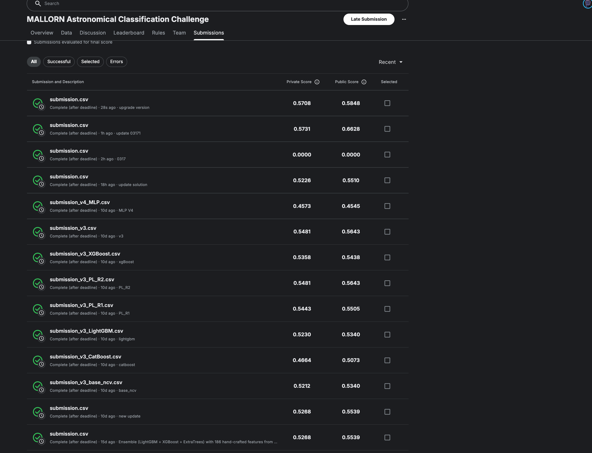

# MALLORN Astronomical Classification Challenge

## Overview

This project tackles the [MALLORN Astronomical Classification Challenge](https://www.kaggle.com/competitions/mallorn-astronomical-classification-challenge) Kaggle competition. The goal is to identify **Tidal Disruption Events (TDEs)** — stars torn apart by supermassive black holes — from simulated LSST multi-band light curves constructed from real ZTF observations.

**Competition Metric:** F1 Score (binary classification, target = 1 for TDE).

## Dataset

| Split | Objects | TDE (target=1) | Non-TDE (target=0) |
|-------|---------|-----------------|---------------------|
| Train | 3,043   | ~64             | ~2,979              |
| Test  | 7,135   | Unknown         | Unknown             |

The training set is **severely imbalanced** (~2% TDE). Non-TDE objects include AGN (Active Galactic Nuclei) and Type II Supernovae (SN II).

Each object has:
- **Metadata**: redshift (`Z`, `Z_err`), extinction (`EBV`), spectral type (`SpecType`)
- **Light curves**: multi-band (u, g, r, i, z, y) time-series photometry split across 20 data files, with columns `object_id`, `Time (MJD)`, `Filter`, `Flux`, `Flux_err`

## Data Parsing

The competition data is split into two parts: **metadata** and **light curves**.

### Metadata

Two CSV files at the top level:

- `train_log.csv` — 3,043 training objects with columns:
  - `object_id`: unique Tolkien-themed identifier (e.g. `Dornhoth_fervain_onodrim`)
  - `Z`, `Z_err`: redshift and its uncertainty (Z_err is missing for some objects)
  - `EBV`: dust extinction value
  - `SpecType`: spectral type — `AGN`, `SN II`, or `TDE`
  - `split`: which data split the light curve belongs to (`split_01` ... `split_20`)
  - `target`: binary label (1 = TDE, 0 = non-TDE)

- `test_log.csv` — 7,135 test objects with the same columns (except `target`)

### Light Curves

Light curve data is distributed across 20 subdirectories (`split_01/` to `split_20/`), each containing:
- `train_full_lightcurves.csv`
- `test_full_lightcurves.csv`

Each light curve file has columns:
- `object_id`: links back to the metadata
- `Time (MJD)`: observation timestamp in Modified Julian Date
- `Flux`: measured brightness
- `Flux_err`: flux measurement uncertainty
- `Filter`: LSST photometric band — one of `u`, `g`, `r`, `i`, `z`, `y`

Each split file contains ~26K (train) or ~59K (test) observation rows. To reconstruct a complete dataset, all 20 splits must be concatenated:

```python
train_log = pd.read_csv("data/train_log.csv")
test_log = pd.read_csv("data/test_log.csv")

train_lcs, test_lcs = [], []
for i in range(1, 21):
    d = f"data/split_{i:02d}"
    train_lcs.append(pd.read_csv(f"{d}/train_full_lightcurves.csv"))
    test_lcs.append(pd.read_csv(f"{d}/test_full_lightcurves.csv"))

train_lc = pd.concat(train_lcs, ignore_index=True)
test_lc = pd.concat(test_lcs, ignore_index=True)
```

Each `object_id` has multi-band time-series observations. To get a single object's light curve:

```python
obj_lc = train_lc[train_lc["object_id"] == "Dornhoth_fervain_onodrim"]
# Filter by band: obj_lc[obj_lc["Filter"] == "g"]
```

## Methodology

### 1. Feature Engineering

The final approach (Approach 5) extracts **1,300+ features** from each object's light curve through a comprehensive pipeline:

**Data Augmentation (Channel Injection)**
- **SNR channels**: 6 virtual bands computed as `Flux / Flux_err`, capturing signal quality variation
- **Normalized Shape channels**: 6 bands normalized by per-band amplitude (`Flux / (max - min)`), isolating shape from brightness
- This expands the original 6 bands to **18+ channels** for feature extraction

**Per-Band Features (computed per filter, then pivoted across all channels)**
- Statistical features: max, mean, std, observation count, time span
- Resampled signal features: FFT power spectrum (mean, dominant frequency), rolling std, skewness
- Physical binning: flux mean and skewness in 8 time bins centered on peak
- Advanced shape: kurtosis, quantile ratios (Q90/Q50, Q100/Q50)
- Gradient features: max rise/decay rate, rise-decay ratio, mean acceleration
- Power-law decay fit: log-log regression on post-peak decay (motivated by TDE t^-5/3 theory)
- Lomb-Scargle periodogram: dominant period power, frequency, and power ratio
- Integral features: total flux area, rise/decay area, area ratio and spread
- Luminosity features: flux converted to absolute luminosity using cosmological distance

**Global/Cross-Band Features**
- TDE asymmetry ratio: rise time vs decline time
- Robust stacked features: multi-band normalized stacking with Savitzky-Golay smoothing, extracting FWHM, rise/decay slopes, smoothness
- Color features: time-matched flux differences across 9 band pairs, computed for all channel types (flux, SNR, normalized, SNR-normalized)
- Rest-frame kinematics: kinematic features corrected for cosmological time dilation and luminosity distance

**Metadata Interactions**
- Flux statistics divided by redshift, Z x EBV, log transforms, missing value indicators

### 2. Multi-Track GBDT Army

Instead of a single model configuration, I train a **"GBDT army"** — multiple tracks with diverse hyperparameters to maximize ensemble diversity:

| Diversity Axis | Variations |
|---|---|
| `scale_pos_weight` | 12, 15, 16, 18, 20 |
| Random seed | Different seeds per track |
| Evaluation metric | Binary logloss vs AUC |
| Learning rate | Fast (0.05) vs Slow (0.03) |

Each track contains **4 model types**:
- **XGBoost** — histogram-based gradient boosting
- **LightGBM** — leaf-wise gradient boosting
- **CatBoost** — ordered boosting with symmetric trees
- **ExtraTrees** — randomized splits for complementary diversity

With 9 tracks × 4 models × 5 folds = **180 GBDT models** total. Each track's 4 models are blended (XGB 0.4, CatBoost 0.3, LGB 0.2, ET 0.1), then all tracks are combined.

### 3. 1D CNN-LSTM on Raw Light Curves

To provide genuine architectural diversity beyond tree-based models, I train a **1D CNN-LSTM** directly on the resampled multi-band time series:

- **Input**: 12-channel tensor (6 flux bands + 6 SNR bands), each resampled to 150 uniform time steps with per-channel normalization
- **Architecture**: Multi-scale Inception convolution (kernel 3/7/15) → Conv blocks → Bidirectional LSTM → Attention pooling → Classifier
- **Training**: AdamW optimizer, CosineAnnealingWarmRestarts scheduler, BCEWithLogitsLoss with pos_weight, gradient clipping
- 5-fold CV, 50 epochs per fold

### 4. Hill Climbing Weight Optimization

Rather than grid search, I use **simulated annealing hill climbing** (2000 iterations) to find optimal blend weights across all GBDT tracks and the DL model. This explores a much larger weight space than exhaustive grid search.

### 5. Disagreement-Based Regional Thresholding

The key insight is that **samples where models disagree need different treatment**:

1. Compute pairwise disagreement between model predictions (GBDT vs DL, or inter-track differences)
2. Split samples into Low / Mid / High disagreement regions with optimized boundaries
3. Optimize classification threshold **independently per region** on OOF predictions
4. Apply hard-rule arbitration: when models have extreme disagreement (>0.5) and one model has very low confidence (<0.05), conservatively predict negative

### 6. Cross-Validation

- **5-fold Stratified K-Fold** ensures each fold preserves the TDE class ratio
- Each model produces out-of-fold (OOF) predictions used for ensemble optimization
- Early stopping (patience=150 rounds) for all gradient boosting models

## Experiments & Results

We explored multiple approaches, progressively improving the pipeline. All scores are F1 on Kaggle's private/public leaderboard.

### Kaggle Submission Results



> Kaggle Profile: [jackieveloped](https://www.kaggle.com/jackieveloped)

### Approach 1: Baseline Ensemble (LightGBM + XGBoost + ExtraTrees)

- **Features**: ~150 hand-crafted features (global flux statistics, temporal features, variability indices, per-filter features, color features, cross-filter timing, metadata interactions)
- **Models**: LightGBM, XGBoost, ExtraTrees with 5-fold stratified CV
- **Ensemble**: Grid search over ensemble weights + threshold optimization on OOF predictions
- **No oversampling**

| Submission | Private Score | Public Score |
|---|---|---|
| Ensemble (weight-optimized) | 0.5268 | 0.5539 |

### Approach 2: Enhanced Features + Stacking + SMOTE

- **Features**: ~267 features — added Bazin function fits, structure function, autocorrelation, flux asymmetry, rolling statistics, Stetson K index
- **Models**: LightGBM, XGBoost, CatBoost, ExtraTrees, BalancedRandomForest (5-model)
- **SMOTE** oversampling (k=3) within each CV fold
- **Stacking**: Logistic Regression meta-learner on base model outputs
- **10-fold CV** with nested CV threshold selection

> This approach did not yield a clear improvement over Approach 1, likely due to feature noise from the larger feature set and potential overfitting with 5 models on a small TDE sample.

### Approach 3: Feature Selection + Optuna Tuning + Pseudo-Labeling

- **Features**: Top 60 features selected via multi-seed LightGBM importance (seeds: 42, 123, 456) — reduced noise from the 267-feature set
- **Models**: LightGBM, XGBoost, CatBoost (focused 3-model ensemble, dropped weaker models)
- **Optuna** Bayesian hyperparameter tuning: 50 trials per model
- **SMOTE** (k=3) within 10-fold CV
- **Pseudo-Labeling**: 2 rounds of self-training on high-confidence test predictions
  - Round 1: pos >= 0.90, neg <= 0.05
  - Round 2: pos >= 0.85, neg <= 0.08
- **Nested CV** threshold selection (median from 5-fold inner CV)

| Submission | Private Score | Public Score |
|---|---|---|
| **3-Model Ensemble** | **0.5481** | **0.5643** |
| **Pseudo-Label Round 2** | **0.5481** | **0.5643** |
| Pseudo-Label Round 1 | 0.5443 | 0.5505 |
| XGBoost (single model) | 0.5358 | 0.5438 |
| LightGBM (single model) | 0.5230 | 0.5340 |
| Base Ensemble (nested CV threshold) | 0.5212 | 0.5340 |
| CatBoost (single model) | 0.4664 | 0.5073 |

### Approach 4: MLP + Multi-Seed Blending

- **Features**: Same top 60 features as Approach 3, with StandardScaler for MLP
- **Models**: LightGBM, XGBoost, CatBoost, **MLP** (scikit-learn MLPClassifier, 2-3 hidden layers)
- **Multi-seed blending**: Each model trained with 3 seeds (42, 123, 456) x 10-fold CV, predictions averaged across seeds for stability
- **Optuna** tuning for all 4 models (40-50 trials each)
- **Pseudo-Labeling**: 2 rounds (same thresholds as Approach 3)

| Submission | Private Score | Public Score |
|---|---|---|
| MLP (single model) | 0.4573 | 0.4545 |

> MLP underperformed tree-based models significantly. Multi-seed blending added training cost without improving over Approach 3's focused ensemble.

### Approach 5: Comprehensive Feature Pipeline + Multi-Track GBDT Army + CNN-LSTM

This approach represents a fundamental redesign of the entire pipeline:

- **Features**: 1,300+ features via comprehensive pipeline — SNR/normalized channel injection, FFT, Lomb-Scargle periodogram, power-law decay fit, physical binning, integral features, luminosity correction, rest-frame kinematics, multi-channel color features
- **GBDT Army**: 9 diverse tracks (different `scale_pos_weight`, seeds, metrics, learning rates) x 4 models (XGBoost, LightGBM, CatBoost, ExtraTrees) = 180 tree models
- **1D CNN-LSTM**: Multi-scale Inception CNN + BiLSTM + Attention on resampled 12-channel light curves
- **Hill Climbing**: Simulated annealing optimizer for blend weights (2000 iterations)
- **Disagreement-based regional thresholding**: per-region F1 threshold optimization based on model disagreement

| Submission | Private Score | Public Score |
|---|---|---|
| **GBDT Army (5 tracks)** | **0.5731** | **0.6628** |
| GBDT Army (9 tracks + feature selection) | 0.5708 | 0.5848 |

> The 5-track version outperformed the 9-track version on public score, suggesting that additional tracks with feature selection introduced slight overfitting. The simpler 5-track army with all 1,300+ features generalized better.

### Summary

| Approach | Best Private Score | Best Public Score | Key Technique |
|---|---|---|---|
| Baseline Ensemble | 0.5268 | 0.5539 | Weight-optimized 3-model ensemble |
| Enhanced Features + Stacking | ~0.5268 | ~0.5539 | SMOTE + 5-model stacking |
| Feature Selection + Optuna + PL | 0.5481 | 0.5643 | Feature selection + HPO + pseudo-labeling |
| MLP + Multi-Seed | 0.4573 | 0.4545 | Neural network + multi-seed blending |
| **Multi-Track GBDT Army** | **0.5731** | **0.6628** | Comprehensive features + GBDT army + regional thresholding |

**Best result: Public F1 = 0.6628, Private F1 = 0.5731** achieved by the Approach 5 multi-track GBDT army.

### Key Takeaways

- **Comprehensive feature engineering is the single largest driver of improvement**: expanding from 150 to 1,300+ features with domain-specific transforms (FFT, Lomb-Scargle, power-law decay, luminosity correction) provided the biggest score jump (+0.10 on public F1)
- **Channel augmentation amplifies feature diversity**: injecting SNR and normalized shape channels before feature extraction effectively triples the feature space without additional hand-crafting
- **Multi-track diversity beats single-config tuning**: varying `scale_pos_weight`, evaluation metric, and learning rate across tracks creates genuine ensemble diversity that outperforms a single heavily-tuned model
- **Feature selection requires caution**: aggressive feature filtering (1,300 -> ~700) slightly hurt generalization in this case, likely because some "low-importance" features contributed useful signal in combination
- **Threshold optimization is critical** for imbalanced classification — optimal threshold was far below 0.5
- **Tree-based models dominate** on tabular astronomical features: XGBoost and LightGBM consistently outperform neural network approaches (MLP, CNN-LSTM) when features are well-engineered

## Project Structure

```
mallorn-astronomical-classification-challenge/
├── data/
│   ├── train_log.csv                    # Train metadata (3,043 objects)
│   ├── test_log.csv                     # Test metadata (7,135 objects)
│   ├── sample_submission.csv            # Expected submission format
│   └── split_01/ ... split_20/          # Light curve data
│       ├── train_full_lightcurves.csv
│       └── test_full_lightcurves.csv
├── mallorn_classification.ipynb         # Approach 5: Multi-track GBDT army (best)
├── mallorn_classification_v2.ipynb      # Approach 2: Enhanced features + stacking
├── mallorn_classification_v3.ipynb      # Approach 3: Feature selection + Optuna + PL
├── mallorn_classification_v4.ipynb      # Approach 4: MLP + multi-seed blending
├── doc/
│   ├── image.png                        # Kaggle submission screenshot
│   └── MALLORN_Report.docx             # Detailed report
├── requirements.txt                     # Python dependencies
└── README.MD
```

## How to Run

Upload and run any notebook on Kaggle with the competition dataset attached. Each notebook includes EDA, full training pipeline, and submission generation.

For the best-performing Approach 5 (`mallorn_classification.ipynb`), a GPU runtime is recommended for the CNN-LSTM component, though the GBDT army runs on CPU.

## Dependencies

- Python 3.12
- pandas, numpy, scipy
- scikit-learn
- lightgbm
- xgboost
- catboost
- pytorch (for CNN-LSTM)
- astropy (for luminosity features)
- matplotlib
- tqdm, joblib

## Analysis

- **Class imbalance is the central challenge**: only ~2% of training objects are TDEs. Standard accuracy metrics would be misleading; F1 score focuses on the minority class. Threshold optimization on OOF predictions is essential.
- **TDEs have distinctive light curve morphology**: rapid flux rise followed by a power-law decline, which differs from the stochastic variability of AGN and the plateau behavior of SN II. Features capturing rise/decline asymmetry and variability indices are among the most important.
- **Multi-band color evolution matters**: TDEs show characteristic blue color that evolves over time, captured by cross-filter peak delays and color features.
- **Redshift normalization is physically motivated**: dividing flux-based features by redshift accounts for distance effects, making features more comparable across objects at different distances.
- **Ensemble diversity improves robustness**: combining models with different architectures (XGBoost, LightGBM, CatBoost, ExtraTrees), different hyperparameters, and different optimization targets creates a more robust final prediction than any single model.
- **Disagreement-based routing is effective**: samples where models agree strongly can be classified with higher confidence, while samples with high inter-model disagreement benefit from more conservative thresholds.
